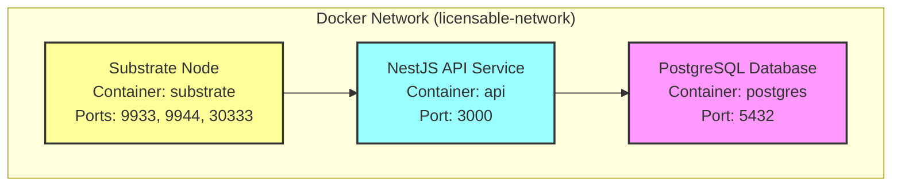
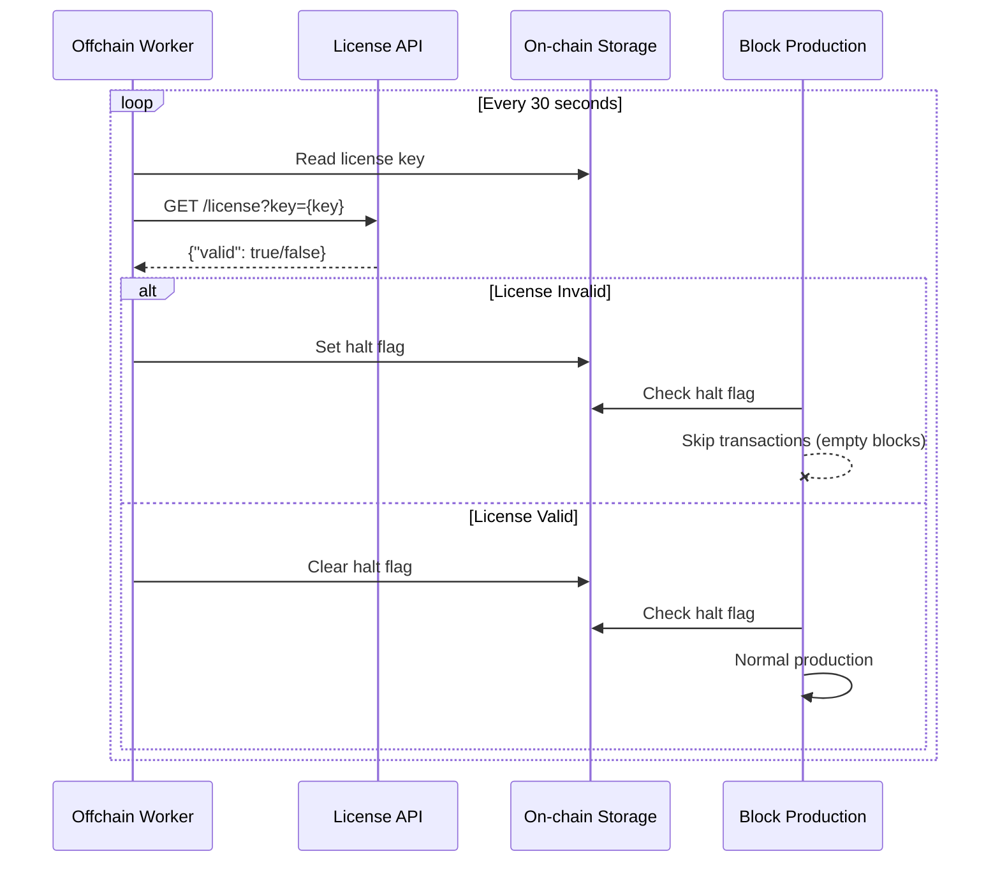

# Licensable Runtime

A Substrate-based blockchain runtime with integrated license validation via offchain workers and a NestJS API service. This implementation demonstrates how to halt block production based on external license validation, making it suitable for enterprise blockchain deployments requiring licensing compliance.

## Table of Contents

- [Architecture Overview](#architecture-overview)
- [Features](#features)
- [Prerequisites](#prerequisites)
- [Installation](#installation)
- [Quick Start](#quick-start)
- [Development Setup](#development-setup)
- [Testing Guide](#testing-guide)
- [License Validation Flow](#license-validation-flow)
- [Project Structure](#project-structure)
- [Configuration](#configuration)
- [Troubleshooting](#troubleshooting)
- [Additional Resources](#additional-resources)

## Architecture Overview

The project uses a **microservices architecture** with three separate Docker containers:



### Components

1. **Substrate Node** (`licensable-substrate`)
   - Blockchain node with custom licensed-aura pallet
   - Offchain workers for license validation
   - Ports: 9933 (RPC HTTP), 9944 (RPC WebSocket), 30333 (P2P), 9615 (Prometheus)

2. **NestJS API** (`licensable-api`)
   - REST API for license management
   - TypeORM with PostgreSQL
   - Port: 3000

3. **PostgreSQL** (`licensable-postgres`)
   - Database for license storage
   - Port: 5432

## Features

- ✅ **License-Controlled Block Production**: Substrate node can halt/resume block production based on license validity
- ✅ **Offchain Worker Integration**: Automatic license validation every 30 seconds
- ✅ **Microservices Architecture**: Clean separation of concerns with Docker containers
- ✅ **Auto-Recovery Mechanism**: Automatic production resume after configurable block count
- ✅ **REST API**: License management through NestJS API
- ✅ **Docker Support**: Complete Docker and Docker Compose setup
- ✅ **Omni-Node Support**: Compatible with Polkadot Omni-Node for parachain deployment
- ✅ **Git Hooks**: Pre-commit and pre-push hooks with Lefthook

## Prerequisites

### Required Software

- **Rust** (nightly-2024-11-15): Required for Substrate runtime compilation
- **Node.js** 18+: Required for NestJS API service
- **pnpm** 8+: Package manager for Node.js dependencies
- **Docker** 20.10+: For containerized deployment
- **Docker Compose** 2.0+: For orchestrating multiple containers
- **PostgreSQL** (optional): Only needed if running without Docker

### System Requirements

- **RAM**: Minimum 4GB available
- **Disk Space**: Minimum 10GB available
- **OS**: Linux, macOS, or Windows with WSL2

## Installation

### Rust Setup

This project uses Rust nightly toolchain as specified in `rust-toolchain.toml`:

```toml
[toolchain]
channel = "nightly-2024-11-15"
targets = ["wasm32-unknown-unknown"]
components = ["rust-src"]
```

#### Install Rust and Dependencies

1. **Install Rust via rustup**:
```bash
curl --proto '=https' --tlsv1.2 -sSf https://sh.rustup.rs | sh
source ~/.cargo/env
```

2. **Install build dependencies**:

**Ubuntu/Debian**:
```bash
sudo apt update
sudo apt install -y git clang curl libssl-dev llvm libudev-dev
```

**macOS**:
```bash
# Install Homebrew if necessary
/bin/bash -c "$(curl -fsSL https://raw.githubusercontent.com/Homebrew/install/master/install.sh)"
brew update
brew install openssl
```

**Apple Silicon (M1/M2)**: Ensure Rosetta 2 is installed:
```bash
softwareupdate --install-rosetta
```

3. **Configure Rust toolchain**:
```bash
# The project's rust-toolchain.toml will automatically select nightly-2024-11-15
# Just ensure you have rustup installed
rustup show  # Verify the correct toolchain is active
```

### Project Setup

1. **Clone the repository**:
```bash
git clone <repository-url>
cd licensable-runtime
```

2. **Install dependencies**:
```bash
# Install root dependencies (prettier, lefthook)
pnpm install

# Install API service dependencies
cd api-service && pnpm install && cd ..
```

3. **Setup git hooks** (automatically done by pnpm install):
```bash
# Hooks are configured via lefthook.yml
# Pre-commit: Runs formatting and clippy
# Pre-push: Runs release build
```

## Quick Start

### Using Docker (Recommended)

The fastest way to get started:

```bash
# Using the convenience script
.maintain/start-local.sh

# Or using pnpm scripts
pnpm docker
```

This will:
1. Build all Docker images
2. Start PostgreSQL, NestJS API, and Substrate node
3. Initialize and seed the database
4. Display service logs

### Docker Commands

| Command | Description |
|---------|-------------|
| `pnpm docker` | Build and start all services with logs |
| `pnpm docker:build` | Build Docker images |
| `pnpm docker:up` | Start all services in background |
| `pnpm docker:down` | Stop all services |
| `pnpm docker:logs` | View service logs |
| `pnpm docker:status` | Check service status |
| `pnpm docker:restart` | Restart all services |
| `pnpm docker:seed` | Seed the database with test data |
| `pnpm docker:clean` | Stop services and remove volumes |

### Using Polkadot Omni-Node

For parachain deployment:

```bash
# Build and run with omni-node
pnpm omni:start

# Or step by step:
pnpm omni:generate  # Update chain spec with new runtime
pnpm omni:run       # Run the omni-node
```

## Development Setup

### Manual Setup (Without Docker)

1. **Setup PostgreSQL**:
```bash
# Using Docker for PostgreSQL only
docker run -d \
  --name local-postgres \
  -e POSTGRES_USER=postgres \
  -e POSTGRES_PASSWORD=postgres \
  -e POSTGRES_DB=license_db \
  -p 5432:5432 \
  postgres:15-alpine
```

2. **Configure API Service** (`api-service/.env`):
```env
DB_HOST=localhost
DB_PORT=5432
DB_USERNAME=postgres
DB_PASSWORD=postgres
DB_NAME=license_db
PORT=3000
NODE_ENV=development
```

3. **Build and run**:
```bash
# Build everything
pnpm build

# Or separately:
pnpm build:runtime  # Substrate runtime
pnpm build:api      # NestJS API

# Run services
pnpm dev:runtime    # In terminal 1
pnpm dev:api        # In terminal 2
```

### Available Commands

```bash
# Development
pnpm dev:runtime      # Run Substrate node in dev mode
pnpm dev:api          # Run API service in dev mode

# Building
pnpm build            # Build everything
pnpm build:runtime    # Build runtime only
pnpm build:api        # Build API only

# Testing
pnpm test             # Run all tests
pnpm lint             # Run clippy linter
pnpm format           # Format all code

# Docker
pnpm docker           # Start with Docker
pnpm docker:seed      # Seed database

# Omni-Node
pnpm omni:start       # Start omni-node
pnpm omni:generate    # Update chain spec
```

## Testing Guide

### 1. Verify Services

```bash
# Check API health
curl http://localhost:3000/health

# Check Substrate node
curl http://localhost:9933

# Check PostgreSQL
docker exec licensable-postgres pg_isready -U postgres
```

### 2. Test License Validation

The seed script creates three test licenses:

| License Key | Status | Description |
|-------------|--------|-------------|
| `valid-license-key-12345` | Valid | Active, expires in 30 days |
| `expired-license-key-67890` | Expired | Expired 30 days ago |
| `inactive-license-key-11111` | Inactive | Valid date but deactivated |

```bash
# Valid license
curl "http://localhost:3000/license?key=valid-license-key-12345"
# Expected: {"valid":true,"message":"License is valid"}

# Expired license
curl "http://localhost:3000/license?key=expired-license-key-67890"
# Expected: {"valid":false,"message":"License has expired"}

# Invalid license
curl "http://localhost:3000/license?key=nonexistent"
# Expected: {"valid":false,"message":"License not found"}
```

### 3. Test Substrate RPC

```bash
# Get chain info
curl -H "Content-Type: application/json" \
  -d '{"id":1, "jsonrpc":"2.0", "method": "system_chain"}' \
  http://localhost:9933

# Get node health
curl -H "Content-Type: application/json" \
  -d '{"id":1, "jsonrpc":"2.0", "method": "system_health"}' \
  http://localhost:9933
```

## License Validation Flow



### Key Components

1. **Licensed-Aura Pallet** (`pallets/licensed-aura/`)
   - Extends standard Aura consensus
   - Manages halt/resume production states
   - Integrates offchain worker for license checks

2. **Offchain Worker**
   - Runs every 30 seconds
   - Validates license with external API
   - Submits unsigned transactions to halt production

3. **NestJS API Service** (`api-service/`)
   - REST endpoints for license management
   - PostgreSQL database integration
   - Health check and validation endpoints

## Project Structure

```
licensable-runtime/
├── .maintain/              # Docker and maintenance files
│   ├── Dockerfile         # Substrate node Docker build
│   ├── Dockerfile.api     # NestJS API Docker build
│   ├── docker-compose.yml # Microservices orchestration
│   ├── chain-spec.json    # Chain specification
│   └── README.md          # Detailed Docker documentation
├── api-service/           # NestJS license validation API
│   ├── src/
│   │   ├── controllers/   # REST endpoints
│   │   ├── services/      # Business logic
│   │   └── entities/      # TypeORM models
│   └── package.json
├── node/                  # Substrate node implementation
│   └── src/
│       ├── chain_spec.rs  # Genesis configuration
│       └── service.rs     # Node service setup
├── pallets/
│   └── licensed-aura/     # Custom Aura pallet
│       ├── src/
│       │   └── lib.rs     # License validation logic
│       └── README.md      # Pallet documentation
├── runtime/               # Runtime configuration
│   └── src/
│       └── lib.rs        # Runtime composition
├── env-setup/            # Environment setup files
│   ├── rust-toolchain.toml
│   └── README.md
├── rust-toolchain.toml   # Project Rust version
├── Cargo.toml            # Workspace configuration
├── lefthook.yml          # Git hooks configuration
└── package.json          # Root package with scripts
```

## Configuration

### Chain Specification

The chain specification can be configured in `.maintain/chain-spec.json`:

- **Token Symbol**: KPG
- **Token Decimals**: 12
- **License Key**: Set in `licensedAura` section

### Environment Variables

For the API service (`.env`):

```env
NODE_ENV=production
DB_HOST=postgres
DB_PORT=5432
DB_USERNAME=postgres
DB_PASSWORD=postgres
DB_NAME=license_db
PORT=3000
```

### License Key Management

Set the license key via:

1. **Genesis config** in chain spec
2. **Runtime extrinsic**: `licensedAura.setLicenseKey(key)` (requires sudo)

## Troubleshooting

### Common Issues

#### Port Conflicts
```bash
# Find process using port
lsof -i :3000
# Kill process
kill -9 <PID>
```

#### Database Connection Failed
```bash
# Check PostgreSQL
docker ps | grep postgres
docker logs licensable-postgres
```

#### Rosetta/Architecture Issues (Apple Silicon)
```bash
# Rebuild for ARM64
.maintain/start-local.sh --build

# Or use Omni-Node
.maintain/start-local.sh --omni
```

#### Build Failures
```bash
# Clean Docker cache
docker system prune -a

# Fresh rebuild
pnpm docker:clean && pnpm docker:build
```

### Debug Commands

```bash
# View logs
pnpm docker:logs

# Access containers
docker exec -it licensable-substrate bash
docker exec -it licensable-api sh
docker exec -it licensable-postgres psql -U postgres -d license_db

# Check service health
docker ps --format "table {{.Names}}\t{{.Status}}"
```

## Production Considerations

For production deployment:

1. **Remove --dev flag** from Substrate node
2. **Use proper chain spec** with production genesis
3. **Secure PostgreSQL** with strong passwords
4. **Add SSL/TLS** via reverse proxy
5. **Implement monitoring** with Prometheus/Grafana
6. **Set resource limits** in docker-compose
7. **Configure backup strategy** for database and chain data

## Additional Resources

- [Substrate Documentation](https://docs.substrate.io/)
- [Polkadot SDK Documentation](https://paritytech.github.io/polkadot-sdk/master)
- [Docker Documentation](https://docs.docker.com/)
- [NestJS Documentation](https://docs.nestjs.com/)
- [Detailed Docker Setup](.maintain/README.md)
- [Licensed Aura Pallet](pallets/licensed-aura/README.md)

## License

MIT - See LICENSE file for details

## Support

For issues or questions:
1. Check the [Troubleshooting](#troubleshooting) section
2. Review logs with `pnpm docker:logs`
3. See [.maintain/README.md](.maintain/README.md) for detailed Docker documentation
4. Open an issue on the project repository