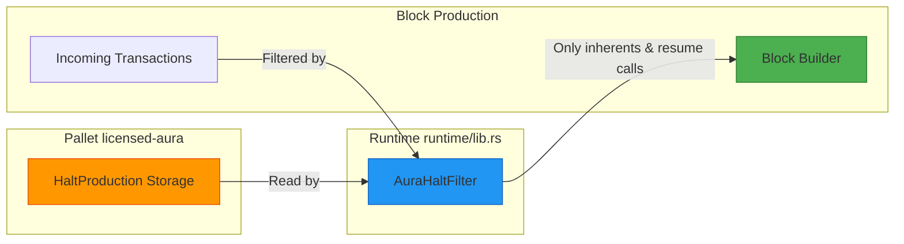
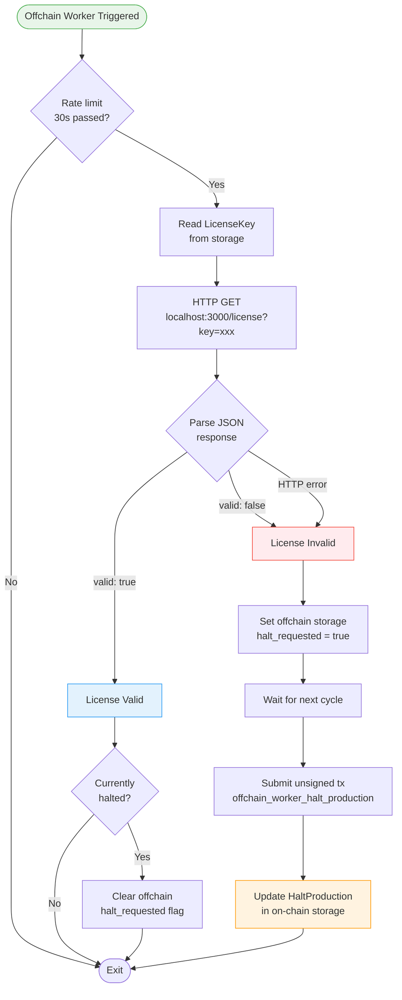

# Licensed Aura Pallet

A custom Substrate pallet that extends the standard Aura consensus mechanism with license validation capabilities. This pallet enables **controlled transaction execution** based on external license validation, suitable for enterprise blockchain deployments requiring licensing compliance.

## Overview

The Licensed Aura pallet provides:
- **License Validation**: Offchain workers validate licenses against an external API every 30 seconds
- **Transaction Control**: Halt/resume transaction execution while keeping blocks producing (empty blocks when halted)
- **Flexible Management**: Both automated (via offchain worker) and manual (via sudo) control
- **Recovery Mechanism**: Manual resume capability through sudo calls

## Quick Reference Card

```
┌─────────────────────────────────────────────────────────┐
│                 Licensed Aura Quick Ref                 │
├─────────────────────────────────────────────────────────┤
│                                                         │
│  📍 Pallet Location: pallets/licensed-aura/src/lib.rs   │
│  📍 Runtime Filter: runtime/src/lib.rs (AuraHaltFilter) │
│                                                         │
│  Storage:                                               │
│    • HaltProduction: bool                               │
│    • LicenseKey: Option<BoundedVec<u8, 128>>            │
│    • HaltReason: Option<BoundedVec<u8, 256>>            │
│                                                         │
│  Extrinsics:                                            │
│    • sudo_halt_production(reason)                       │
│    • sudo_resume_production()                           │
│    • set_license_key(key)                               │
│    • offchain_worker_halt_production(reason) [unsigned] │
│                                                         │
│  Configuration:                                         │
│    • Rate Limit: 30 seconds (line 411)                  │
│    • API: http://localhost:3000/license                 │
│    • HTTP Timeout: 5 seconds (line 449)                 │
│                                                         │
│  Resume:                                                │
│    sudo.sudo(aura.sudoResumeProduction())               │
│                                                         │
└─────────────────────────────────────────────────────────┘
```

## How It Works

### Key Concept: Empty Blocks While Halted

When a license is invalid, the blockchain doesn't stop producing blocks. Instead, it produces **empty blocks** (blocks with no transactions except mandatory inherents like timestamps). This is achieved through two mechanisms working together:

1. **`HaltProduction` Storage Flag**: Set by the pallet when license is invalid
2. **`AuraHaltFilter` (Runtime)**: Filters out transactions when `HaltProduction` is true



## Complete System Flow

```mermaid
sequenceDiagram
    participant OCW as Offchain Worker
    participant API as License API
    participant Storage as HaltProduction Storage
    participant Filter as AuraHaltFilter Runtime
    participant Block as Block Production

    Note over OCW: Every 30 seconds

    OCW->>API: GET /license?key=xxx
    API-->>OCW: {"valid": false}

    OCW->>Storage: Set HaltProduction = true

    Note over Block: Next block production

    Block->>Storage: Read HaltProduction
    Storage-->>Block: HaltProduction = true

    Block->>Filter: Check transaction X
    Filter->>Storage: Is halted?
    Storage-->>Filter: true
    Filter-->>Block: REJECT (not timestamp/resume)

    Block->>Filter: Check Timestamp inherent
    Filter-->>Block: ALLOW (mandatory inherent)

    Block->>Block: Produce empty block

    Note over Block: Block contains only timestamp

    Note over OCW: Admin fixes license

    loop Manual Resume
        Admin->>Filter: sudo.sudo(Aura.sudo_resume_production)
        Filter->>Storage: Is halted?
        Storage-->>Filter: true
        Filter->>Filter: Check if Sudo(Aura.sudo_resume_production)
        Filter-->>Admin: ALLOW (special case)
        Admin->>Storage: Set HaltProduction = false
    end

    Note over Block: Normal block production resumes

    style OCW fill:#e3f2fd,stroke:#1976d2
    style API fill:#fff3e0,stroke:#f57c00
    style Storage fill:#ffebee,stroke:#c62828
    style Filter fill:#e8f5e9,stroke:#388e3c
    style Block fill:#f3e5f5,stroke:#7b1fa2
```

## Architecture Components

### 1. Pallet Storage (pallets/licensed-aura/src/lib.rs)

| Storage Item | Type | Purpose |
|--------------|------|---------|
| `Authorities` | `BoundedVec<AuthorityId>` | Current authority set for block production |
| `CurrentSlot` | `Slot` | Current slot number for Aura consensus |
| **`HaltProduction`** | `bool` | **Global flag to control transaction execution** |
| `HaltReason` | `Option<BoundedVec<u8, 256>>` | Optional reason for halting (for debugging) |
| `LicenseKey` | `Option<BoundedVec<u8, 128>>` | License key for API validation |

### 2. Pallet Extrinsics

| Extrinsic | Origin | Purpose |
|-----------|--------|---------|
| `sudo_halt_production(reason)` | Root/Sudo | Manually halt transaction execution |
| `sudo_resume_production()` | Root/Sudo | Manually resume transaction execution |
| `offchain_worker_halt_production(reason)` | None (Unsigned) | Automated halt from offchain worker |
| `set_license_key(license_key)` | Root/Sudo | Set/update the license key |

### 3. Runtime Call Filter (runtime/src/lib.rs)

The `AuraHaltFilter` implements `Contains<RuntimeCall>` to filter transactions:

```rust
pub struct AuraHaltFilter;

impl Contains<RuntimeCall> for AuraHaltFilter {
    fn contains(call: &RuntimeCall) -> bool {
        // Always allow timestamp (mandatory inherent)
        if matches!(call, RuntimeCall::Timestamp(_)) {
            return true;
        }

        let halted = pallet_licensed_aura::Pallet::<Runtime>::is_halted();

        if halted {
            // Only allow resume calls while halted
            match call {
                // IMPORTANT: Must handle nested Sudo calls!
                RuntimeCall::Sudo(pallet_sudo::Call::sudo { call })
                | RuntimeCall::Sudo(pallet_sudo::Call::sudo_unchecked_weight { call, .. }) => {
                    // Check the inner call
                    matches!(
                        **call,
                        RuntimeCall::Aura(
                            pallet_licensed_aura::Call::sudo_resume_production { .. }
                        )
                    )
                }
                RuntimeCall::Aura(
                    pallet_licensed_aura::Call::offchain_worker_halt_production { .. }
                ) => true,
                _ => false,
            }
        } else {
            true // Normal mode: allow all
        }
    }
}
```

**Key Points**:
- **Nested Call Handling**: The filter must check inside `sudo()` calls to detect `sudo_resume_production`
- **Mandatory Inherents**: Always allow `Timestamp::set` to keep blocks producing
- **Recursive Pattern**: Uses pattern matching on the inner call to allow `sudo(Aura::sudo_resume_production())`

### 4. Offchain Worker License Validation



### Events & Errors

**Events**:
- `ProductionHalted`: Emitted when `HaltProduction` is set to `true`
- `ProductionResumed`: Emitted when `HaltProduction` is set to `false`

**Errors**:
- `ReasonTooLong`: Halt reason exceeds 256 bytes
- `LicenseKeyTooLong`: License key exceeds 128 bytes
- `LicenseKeyNotSet`: License key not configured

## Usage Examples

### Set License Key

```bash
# Via Polkadot.js Apps or API
api.tx.sudo.sudo(
  api.tx.aura.setLicenseKey("your-license-key-12345")
).signAndSend(sudoAccount);
```

### Manual Halt (for testing or emergency)

```bash
api.tx.sudo.sudo(
  api.tx.aura.sudoHaltProduction("Emergency maintenance")
).signAndSend(sudoAccount);
```

### Manual Resume (after fixing license or emergency)

```bash
api.tx.sudo.sudo(
  api.tx.aura.sudoResumeProduction()
).signAndSend(sudoAccount);
```

## Integration with Runtime

### 1. Pallet Configuration

```rust
impl pallet_licensed_aura::Config for Runtime {
    type RuntimeEvent = RuntimeEvent;
    type AuthorityId = AuraId;
    type MaxAuthorities = ConstU32<32>;
    type DisabledValidators = ();
    type AllowMultipleBlocksPerSlot = ConstBool<false>;
    type SlotDuration = pallet_licensed_aura::MinimumPeriodTimesTwo<Runtime>;
}
```

### 2. Runtime Call Filter Setup

**CRITICAL**: Configure `BaseCallFilter` in `frame_system::Config`:

```rust
use frame_support::traits::Contains;

pub struct AuraHaltFilter;

impl Contains<RuntimeCall> for AuraHaltFilter {
    fn contains(call: &RuntimeCall) -> bool {
        // Always allow timestamp inherents
        if matches!(call, RuntimeCall::Timestamp(pallet_timestamp::Call::set { .. })) {
            return true;
        }

        let halted = pallet_licensed_aura::Pallet::<Runtime>::is_halted();

        if halted {
            match call {
                // Handle nested sudo calls for resume
                RuntimeCall::Sudo(pallet_sudo::Call::sudo { call })
                | RuntimeCall::Sudo(pallet_sudo::Call::sudo_unchecked_weight { call, .. }) => {
                    matches!(
                        **call,
                        RuntimeCall::Aura(pallet_licensed_aura::Call::sudo_resume_production { .. })
                    )
                }
                // Allow OCW halt transactions
                RuntimeCall::Aura(
                    pallet_licensed_aura::Call::offchain_worker_halt_production { .. }
                ) => true,
                _ => false,
            }
        } else {
            true
        }
    }
}

#[derive_impl(frame_system::config_preludes::SolochainDefaultConfig)]
impl frame_system::Config for Runtime {
    // ... other config
    type BaseCallFilter = AuraHaltFilter; // <-- REQUIRED
}
```

### 3. Genesis Configuration

Set the initial license key in your chain spec (`chain-spec.json`):

```json
{
  "aura": {
    "authorities": [
      "5GrwvaEF5zXb26Fz9rcQpDWS57CtERHpNehXCPcNoHGKutQY",
      "5FHneW46xGXgs5mUiveU4sbTyGBzmstUspZC92UhjJM694ty"
    ],
    "licenseKey": "your-valid-license-key-12345"
  }
}
```

## License API Integration

The offchain worker validates licenses against an external REST API.

### API Endpoint

Default: `http://localhost:3000/license?key={license_key}`

### Expected Responses

**Valid License** (HTTP 200):
```json
{
  "valid": true,
  "message": "License is valid"
}
```

**Invalid/Expired License** (HTTP 200):
```json
{
  "valid": false,
  "message": "License has expired"
}
```

**Not Found** (HTTP 200):
```json
{
  "valid": false,
  "message": "License not found"
}
```

## Design Decisions & Rationale

### Why Empty Blocks Instead of Stopping?

**Problem**: We need to enforce licensing without bricking the chain.

**Solution**: Keep blocks producing (with timestamps) but filter out transactions.

**Benefits**:
- ✅ Chain stays alive and recoverable
- ✅ Consensus continues working
- ✅ Can be resumed via sudo without chain restart
- ✅ No risk of permanent chain halt

### Why Separate Pallet + Runtime Filter?

**Pallet (`licensed-aura`)**: Manages the `HaltProduction` state
**Runtime Filter (`AuraHaltFilter`)**: Enforces the halt by filtering calls

This separation allows:
- Clean responsibility separation
- Pallet doesn't need to know about all possible calls
- Easy to customize which calls are allowed while halted

### Why Offchain Worker Instead of On-Chain?

**On-chain** checks would require:
- Oracle or bridge to external API
- Gas costs for every block
- Complex external data verification

**Offchain worker** provides:
- Free HTTP requests (no gas)
- Regular polling (every 30s)
- Can submit unsigned transactions to update state

### Why Nested Sudo Call Handling?

When user calls `sudo.sudo(aura.sudoResumeProduction())`, the call structure is:
```
RuntimeCall::Sudo(
  pallet_sudo::Call::sudo {
    call: Box<RuntimeCall::Aura(
      pallet_licensed_aura::Call::sudo_resume_production {}
    )>
  }
)
```

The filter must unwrap the `sudo` wrapper to check the inner `Aura::sudo_resume_production` call.

## Security Considerations

### Unsigned Transaction Validation

The pallet implements `ValidateUnsigned` for `offchain_worker_halt_production`:
- **Priority**: `u64::MAX` (highest priority)
- **Longevity**: 1 block (prevents replay attacks)
- **Provides**: `"halt_production"` tag (only one halt tx per block)

### Access Control

| Operation | Required Origin | Notes |
|-----------|-----------------|-------|
| `sudo_halt_production` | Root | Admin only |
| `sudo_resume_production` | Root | Admin only |
| `set_license_key` | Root | Admin only |
| `offchain_worker_halt_production` | None (Unsigned) | Validated via `ValidateUnsigned` |

### Attack Vectors & Mitigations

1. **DOS via Spam Halt Transactions**: Mitigated by `provides("halt_production")` - only one per block
2. **Replay Attacks**: Mitigated by `longevity(1)` - only valid for 1 block
3. **Unauthorized Resume**: Only root can call `sudo_resume_production`
4. **License API Manipulation**: API should be secured separately (not in scope)

## Testing & Verification

### 1. Unit Tests

```bash
# Run pallet tests
cargo test -p pallet-licensed-aura

# Run with output
cargo test -p pallet-licensed-aura -- --nocapture
```

### 2. Integration Testing

**Step 1: Set License Key**
```bash
# Via Polkadot.js Apps: Developer > Extrinsics
# Select: sudo.sudo(aura.setLicenseKey("valid-license-key-12345"))
```

**Step 2: Monitor Offchain Worker**
```bash
# Watch node logs for license validation
docker logs -f licensable-substrate | grep "License validation"

# Expected logs:
# - "License validation successful" (every 30s when valid)
# - "License validation failed" (when invalid)
# - "Halt unsigned tx submitted" (when halting)
```

**Step 3: Test Halt Scenario**
```bash
# 1. Change license key to invalid one in the API
# 2. Wait 30 seconds for offchain worker
# 3. Observe: Blocks still produce but contain only timestamp
# 4. Try to send a transfer - it will be rejected by BaseCallFilter
```

**Step 4: Test Resume**
```bash
# Fix license in API or manually resume:
# Via Polkadot.js: sudo.sudo(aura.sudoResumeProduction())
# Verify: Transactions are now accepted
```

### 3. Monitoring

Check the `HaltProduction` state:
```javascript
// Via Polkadot.js Apps: Developer > Chain State
// Query: aura.haltProduction()
// Returns: bool (true = halted, false = normal)
```

Check logs in each block:
```bash
# Empty block (halted):
# - Only contains timestamp inherent
# - No transfers or other extrinsics

# Normal block:
# - Contains multiple extrinsics
# - Transfers, balance changes, etc.
```

## Comparison with Standard Aura

| Aspect | Standard Aura | Licensed Aura |
|--------|--------------|---------------|
| **Block Production** | Always produces blocks | Always produces blocks ✅ |
| **Transaction Execution** | Always executes | Conditional (can be halted) |
| **Offchain Worker** | None | License validation every 30s |
| **Control Mechanism** | None | `HaltProduction` flag + Runtime filter |
| **External Dependencies** | None | License API (HTTP) |
| **Recovery** | N/A | Manual via sudo or automatic on valid license |
| **Unsigned Transactions** | Not used | Used for automated halting |

## Configuration Reference

### Hardcoded Constants (in `lib.rs`)

| Constant | Location | Value | Purpose |
|----------|----------|-------|---------|
| Rate limit | Line 411 | 30,000 ms | Minimum time between license checks |
| API endpoint | Line 447 | `localhost:3000` | License validation API |
| HTTP timeout | Line 449 | 5,000 ms | Maximum time to wait for API response |
| Max reason length | Line 381 | 256 bytes | Maximum halt reason size |
| Max license key length | Line 286 | 128 bytes | Maximum license key size |

### Customization Points

To customize these values, modify `pallets/licensed-aura/src/lib.rs`:

```rust
// Rate limit (line 411)
if now.unix_millis().saturating_sub(last_check) < 30_000 { // Change 30_000

// API endpoint (line 447)
let api_url = alloc::format!("http://localhost:3000/license?key={}", license_key);
// Change to: http://your-api-server.com/validate

// HTTP timeout (line 449)
let deadline = now.add(Duration::from_millis(5_000)); // Change 5_000
```

## Troubleshooting

### Blocks are empty even with valid license

**Check**:
1. Verify `HaltProduction` storage: `aura.haltProduction()` should be `false`
2. Check offchain worker logs for "License validation successful"
3. Verify API is returning `{"valid": true}`

**Fix**: Manually resume via `sudo.sudo(aura.sudoResumeProduction())`

### Offchain worker not calling API

**Check**:
1. License key is set: `aura.licenseKey()` should return a value
2. Node is running with offchain worker enabled (default for `--dev`)
3. API is accessible from the node

**Fix**: Set license key via `sudo.sudo(aura.setLicenseKey("key"))`

### Cannot resume via sudo

**Check**:
1. Using correct nested call: `sudo.sudo(aura.sudoResumeProduction())`
2. `AuraHaltFilter` is configured correctly in runtime
3. Filter handles nested `Sudo` calls (see runtime configuration)

**Fix**: Verify `AuraHaltFilter` implementation matches the example above

## Summary

The Licensed Aura pallet provides license-based transaction control for Substrate blockchains through:

1. **Offchain Worker**: Validates licenses every 30 seconds against external API
2. **HaltProduction Flag**: Controls transaction execution state
3. **Runtime Filter (AuraHaltFilter)**: Enforces the halt by filtering calls
4. **Recovery Mechanism**: Manual resume via sudo when license is valid

**Key Insight**: Blocks continue producing (preventing chain halt), but transactions are filtered out when `HaltProduction` is `true`, resulting in empty blocks containing only mandatory inherents.


## References

- [Aura Consensus](https://docs.rs/pallet-aura/latest/pallet_aura/)
- [Offchain Workers Guide](https://docs.substrate.io/reference/how-to-guides/offchain-workers/)
- [Unsigned Transactions](https://docs.substrate.io/reference/how-to-guides/offchain-workers/offchain-transactions/)
- [BaseCallFilter Documentation](https://docs.rs/frame-system/latest/frame_system/pallet/trait.Config.html#associatedtype.BaseCallFilter)
- [Main Project Documentation](../../README.md)
- [Docker Setup Guide](../../.maintain/README.md)

## License

Apache-2.0 - See LICENSE file in the root directory for details