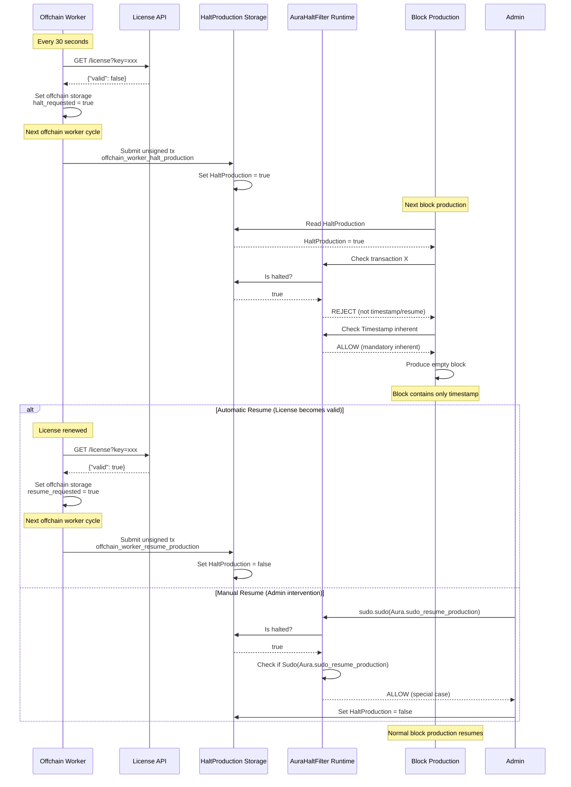
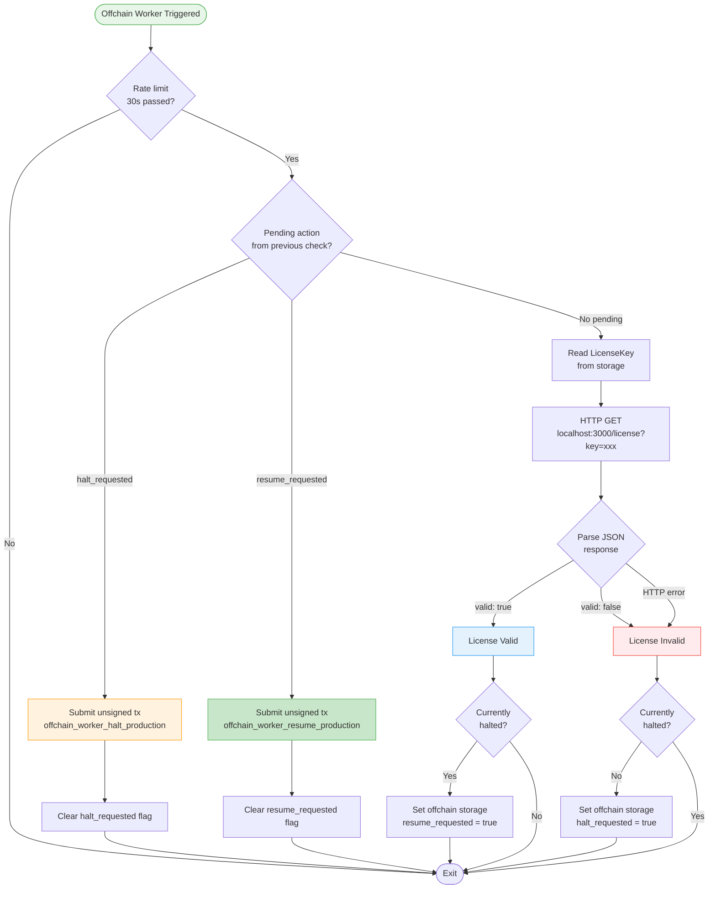

# Licensed Aura Pallet

A custom Substrate pallet that extends the standard Aura consensus mechanism with license validation capabilities. This pallet enables **controlled transaction execution** based on external license validation, suitable for enterprise blockchain deployments requiring licensing compliance.

## Overview

The Licensed Aura pallet provides:
- **License Validation**: Offchain workers validate licenses against an external API every 30 seconds
- **Transaction Control**: Halt/resume transaction execution while keeping blocks producing (empty blocks when halted)
- **Flexible Management**: Both automated (via offchain worker) and manual (via sudo) control
- **Auto-Recovery**: Automated resume when license becomes valid again (via offchain worker)
- **Manual Recovery**: Manual resume capability through sudo calls when needed

## Quick Reference Card

```
┌─────────────────────────────────────────────────────────┐
│                 Licensed Aura Quick Ref                 │
├─────────────────────────────────────────────────────────┤
│                                                         │
│  📍 Pallet Location: pallets/licensed-aura/src/lib.rs   │
│  📍 Runtime Filter: runtime/src/lib.rs (AuraHaltFilter) │
│                                                         │
│  Storage:                                               │
│    • HaltProduction: bool                               │
│    • LicenseKey: Option<BoundedVec<u8, 128>>            │
│    • HaltReason: Option<BoundedVec<u8, 256>>            │
│                                                         │
│  Extrinsics:                                            │
│    • sudo_halt_production(reason)                       │
│    • sudo_resume_production()                           │
│    • set_license_key(key)                               │
│    • offchain_worker_halt_production(reason) [unsigned] │
│    • offchain_worker_resume_production() [unsigned]     │
│                                                         │
│  Configuration:                                         │
│    • Rate Limit: 30 seconds (line 433)                  │
│    • API: http://localhost:3000/license                 │
│    • HTTP Timeout: 5 seconds (line 500)                 │
│                                                         │
│  Resume:                                                │
│    sudo.sudo(aura.sudoResumeProduction())               │
│                                                         │
└─────────────────────────────────────────────────────────┘
```

## ⚠️ Development Status & Known Vulnerabilities

**IMPORTANT**: This pallet is currently in **DEVELOPMENT** and the current version is a **PROOF OF CONCEPT (POC)** only. **DO NOT use in production environments.**

### High-Severity Vulnerabilities

| Issue | Description | Impact |
|-------|-------------|--------|
| **HTTP Spoofing / MITM** | OCW uses unencrypted HTTP to `localhost:3000` without TLS or signature verification | Attacker on same machine/network can manipulate license validation responses |
| **Unsafe JSON Parsing** | License response parsing uses string matching (`find("valid")`) instead of proper JSON parser | Trivially spoofable: `"valid": truee`, `"notvalid": true` all pass validation |
| **Network Loss → Chain Halt** | Any HTTP error (network down, timeout) triggers permanent chain halt | No automatic recovery from transient network issues; requires manual sudo intervention |
| **Race Conditions** | Halt/resume signals use per-node offchain storage, not consensus | Non-deterministic behavior across validators can cause chain forks |

### Medium-Severity Issues

| Issue | Description |
|-------|-------------|
| **Weak Transaction Deduplication** | `and_provides(call)` uses full call encoding, not stable keys | Multiple similar halt/resume transactions can enter same block |
| **Non-Validator OCW Submission** | `TransactionSource::Local` allows any full node to submit unsigned extrinsics | Not restricted to validator set; any RPC node can trigger halt/resume |
| **Assert Panics** | Runtime uses `assert!` for slot validation | Malformed digests or timestamp issues can brick block production |

### Low-Severity Issues

- **Hardcoded Endpoint**: `localhost:3000` not suitable for production deployments
- **No Replay Protection**: OCW storage loss can cause duplicate submissions
- **BaseCallFilter Coordination**: Must ensure Grandpa finality and governance remain functional when halted

### Mitigation Roadmap

To move from POC to production-ready:

1. ✅ Restrict unsigned extrinsics to `TransactionSource::Local` (completed)
2. ⚠️ Implement HTTPS + certificate verification or signed API responses
3. ⚠️ Use proper JSON parser (e.g., `serde_json`)
4. ⚠️ Distinguish network errors from explicit license denial
5. ⚠️ Move halt/resume signaling to consensus layer
6. ⚠️ Add validator-only OCW authorization via `AuthorityId` signatures
7. ⚠️ Replace `assert!` with graceful error handling
8. ⚠️ Make API endpoint configurable via runtime configuration

**For production use, a complete security audit and architectural redesign is required.**

## How It Works

### Key Concept: Empty Blocks While Halted

When a license is invalid, the blockchain doesn't stop producing blocks. Instead, it produces **empty blocks** (blocks with no transactions except mandatory inherents like timestamps). This is achieved through two mechanisms working together:

1. **`HaltProduction` Storage Flag**: Set by the pallet when license is invalid
2. **`AuraHaltFilter` (Runtime)**: Filters out transactions when `HaltProduction` is true


## Complete System Flow



## Architecture Components

### 1. Pallet Storage (pallets/licensed-aura/src/lib.rs)

| Storage Item | Type | Purpose |
|--------------|------|---------|
| `Authorities` | `BoundedVec<AuthorityId>` | Current authority set for block production |
| `CurrentSlot` | `Slot` | Current slot number for Aura consensus |
| **`HaltProduction`** | `bool` | **Global flag to control transaction execution** |
| `HaltReason` | `Option<BoundedVec<u8, 256>>` | Optional reason for halting (for debugging) |
| `LicenseKey` | `Option<BoundedVec<u8, 128>>` | License key for API validation |

### 2. Pallet Extrinsics

| Extrinsic | Origin | Purpose |
|-----------|--------|---------|
| `sudo_halt_production(reason)` | Root/Sudo | Manually halt transaction execution |
| `sudo_resume_production()` | Root/Sudo | Manually resume transaction execution |
| `offchain_worker_halt_production(reason)` | None (Unsigned) | Automated halt from offchain worker |
| `offchain_worker_resume_production()` | None (Unsigned) | Automated resume from offchain worker |
| `set_license_key(license_key)` | Root/Sudo | Set/update the license key |

### 3. Runtime Call Filter (runtime/src/lib.rs)

The `AuraHaltFilter` is now implemented using a trait-based architecture in the pallet (`pallets/licensed-aura/src/filter.rs`), with the runtime implementing the required traits:

```rust
// Import the filter and traits from the licensed aura pallet
use pallet_licensed_aura::filter::{
    AuraHaltFilter, IsLicensedAuraCall, IsSudoCall, IsDefaultInherentExstrinsicCall,
};

// Implement the traits for RuntimeCall
impl IsLicensedAuraCall for RuntimeCall {
    fn is_sudo_resume_production(&self) -> bool {
        matches!(
            self,
            RuntimeCall::Aura(pallet_licensed_aura::Call::sudo_resume_production { .. })
        )
    }

    fn is_offchain_worker_halt(&self) -> bool {
        matches!(
            self,
            RuntimeCall::Aura(pallet_licensed_aura::Call::offchain_worker_halt_production { .. })
        )
    }

    fn is_offchain_worker_resume(&self) -> bool {
        matches!(
            self,
            RuntimeCall::Aura(pallet_licensed_aura::Call::offchain_worker_resume_production { .. })
        )
    }
}

impl IsDefaultInherentExstrinsicCall for RuntimeCall {
    fn is_timestamp_set(&self) -> bool {
        matches!(
            self,
            RuntimeCall::Timestamp(pallet_timestamp::Call::set { .. })
        )
    }
}

impl IsSudoCall<RuntimeCall> for RuntimeCall {
    fn is_sudo_wrapping_allowed(&self) -> bool {
        match self {
            RuntimeCall::Sudo(pallet_sudo::Call::sudo { call })
            | RuntimeCall::Sudo(pallet_sudo::Call::sudo_unchecked_weight { call, .. }) => {
                // Check if the inner call is allowed (resume or halt)
                call.is_sudo_resume_production()
                    || call.is_offchain_worker_halt()
                    || call.is_offchain_worker_resume()
            }
            _ => false,
        }
    }
}

// Configure the filter in frame_system
impl frame_system::Config for Runtime {
    // ... other config
    type BaseCallFilter = AuraHaltFilter<RuntimeCall, Runtime>;
}
```

**Key Points**:
- **Trait-Based Architecture**: The filter logic is now modular and reusable via traits
- **Nested Call Handling**: The `IsSudoCall` trait handles nested `sudo()` calls automatically
- **Mandatory Inherents**: Always allow `Timestamp::set` to keep blocks producing
- **Auto-Resume Support**: The filter now allows both halt and resume operations from the offchain worker

### 4. Offchain Worker License Validation



### Events & Errors

**Events**:
- `ProductionHalted`: Emitted when `HaltProduction` is set to `true`
- `ProductionResumed`: Emitted when `HaltProduction` is set to `false`

**Errors**:
- `ReasonTooLong`: Halt reason exceeds 256 bytes
- `LicenseKeyTooLong`: License key exceeds 128 bytes
- `LicenseKeyNotSet`: License key not configured

## Usage Examples

### Set License Key

```bash
# Via Polkadot.js Apps or API
api.tx.sudo.sudo(
  api.tx.aura.setLicenseKey("your-license-key-12345")
).signAndSend(sudoAccount);
```

### Manual Halt (for testing or emergency)

```bash
api.tx.sudo.sudo(
  api.tx.aura.sudoHaltProduction("Emergency maintenance")
).signAndSend(sudoAccount);
```

### Manual Resume (after fixing license or emergency)

```bash
api.tx.sudo.sudo(
  api.tx.aura.sudoResumeProduction()
).signAndSend(sudoAccount);
```

## Integration with Runtime

### 1. Pallet Configuration

```rust
impl pallet_licensed_aura::Config for Runtime {
    type RuntimeEvent = RuntimeEvent;
    type AuthorityId = AuraId;
    type MaxAuthorities = ConstU32<32>;
    type DisabledValidators = ();
    type AllowMultipleBlocksPerSlot = ConstBool<false>;
    type SlotDuration = pallet_licensed_aura::MinimumPeriodTimesTwo<Runtime>;
}
```

### 2. Runtime Call Filter Setup

**CRITICAL**: Configure `BaseCallFilter` in `frame_system::Config`:

```rust
// Import the filter and traits from the licensed aura pallet
use pallet_licensed_aura::filter::{
    AuraHaltFilter, IsLicensedAuraCall, IsSudoCall, IsDefaultInherentExstrinsicCall,
};

// Implement the required traits for RuntimeCall (see section 3 above for details)
impl IsLicensedAuraCall for RuntimeCall { /* ... */ }
impl IsDefaultInherentExstrinsicCall for RuntimeCall { /* ... */ }
impl IsSudoCall<RuntimeCall> for RuntimeCall { /* ... */ }

// Configure frame_system to use the filter
#[derive_impl(frame_system::config_preludes::SolochainDefaultConfig)]
impl frame_system::Config for Runtime {
    // ... other config
    type BaseCallFilter = AuraHaltFilter<RuntimeCall, Runtime>; // <-- REQUIRED
}
```

### 3. Genesis Configuration

Set the initial license key in your chain spec (`chain-spec.json`):

```json
{
  "aura": {
    "authorities": [
      "5GrwvaEF5zXb26Fz9rcQpDWS57CtERHpNehXCPcNoHGKutQY",
      "5FHneW46xGXgs5mUiveU4sbTyGBzmstUspZC92UhjJM694ty"
    ],
    "licenseKey": "your-valid-license-key-12345"
  }
}
```

## License API Integration

The offchain worker validates licenses against an external REST API.

### API Endpoint

Default: `http://localhost:3000/license?key={license_key}`

### Expected Responses

**Valid License** (HTTP 200):
```json
{
  "valid": true,
  "message": "License is valid"
}
```

**Invalid/Expired License** (HTTP 200):
```json
{
  "valid": false,
  "message": "License has expired"
}
```

**Not Found** (HTTP 200):
```json
{
  "valid": false,
  "message": "License not found"
}
```

## Design Decisions & Rationale

### Why Empty Blocks Instead of Stopping?

**Problem**: We need to enforce licensing without bricking the chain.

**Solution**: Keep blocks producing (with timestamps) but filter out transactions.

**Benefits**:
- ✅ Chain stays alive and recoverable
- ✅ Consensus continues working
- ✅ Can be resumed automatically when license is renewed
- ✅ Can be resumed manually via sudo without chain restart
- ✅ No risk of permanent chain halt

### Why Separate Pallet + Runtime Filter?

**Pallet (`licensed-aura`)**: Manages the `HaltProduction` state and provides filter traits
**Runtime Filter (`AuraHaltFilter`)**: Enforces the halt by filtering calls

This trait-based separation allows:
- Clean responsibility separation
- Pallet doesn't need to know about all possible runtime calls
- Easy to customize which calls are allowed while halted
- Modular and reusable filter architecture
- Runtime implements simple traits to define allowed calls

### Why Offchain Worker Instead of On-Chain?

**On-chain** checks would require:
- Oracle or bridge to external API
- Gas costs for every block
- Complex external data verification

**Offchain worker** provides:
- Free HTTP requests (no gas)
- Regular polling (every 30s)
- Can submit unsigned transactions to update state (both halt and resume)
- Automated recovery when license becomes valid again

### Why Nested Sudo Call Handling?

When user calls `sudo.sudo(aura.sudoResumeProduction())`, the call structure is:
```
RuntimeCall::Sudo(
  pallet_sudo::Call::sudo {
    call: Box<RuntimeCall::Aura(
      pallet_licensed_aura::Call::sudo_resume_production {}
    )>
  }
)
```

The filter must unwrap the `sudo` wrapper to check the inner `Aura::sudo_resume_production` call. This is handled via the `IsSudoCall` trait which the runtime implements. The trait's `is_sudo_wrapping_allowed()` method automatically unwraps nested sudo calls and checks if the inner call is allowed (resume or halt operations).

## Security Considerations

### Unsigned Transaction Validation

The pallet implements `ValidateUnsigned` for both `offchain_worker_halt_production` and `offchain_worker_resume_production`:

**For `offchain_worker_halt_production`**:
- **Priority**: `u64::MAX` (highest priority)
- **Longevity**: 1 block (prevents replay attacks)
- **Provides**: `"halt_production"` tag (only one halt tx per block)

**For `offchain_worker_resume_production`**:
- **Priority**: `u64::MAX` (highest priority)
- **Longevity**: 1 block (prevents replay attacks)
- **Provides**: `"resume_production"` tag (only one resume tx per block)

### Access Control

| Operation | Required Origin | Notes |
|-----------|-----------------|-------|
| `sudo_halt_production` | Root | Admin only |
| `sudo_resume_production` | Root | Admin only |
| `set_license_key` | Root | Admin only |
| `offchain_worker_halt_production` | None (Unsigned) | Validated via `ValidateUnsigned` |
| `offchain_worker_resume_production` | None (Unsigned) | Validated via `ValidateUnsigned` |

### Attack Vectors & Mitigations

1. **DOS via Spam Halt Transactions**: Mitigated by `provides("halt_production")` - only one per block
2. **DOS via Spam Resume Transactions**: Mitigated by `provides("resume_production")` - only one per block
3. **Replay Attacks**: Mitigated by `longevity(1)` - only valid for 1 block
4. **Unauthorized Resume**: Only root or offchain worker (when license is valid) can resume
5. **License API Manipulation**: API should be secured separately (not in scope)

## Testing & Verification

### 1. Unit Tests

```bash
# Run pallet tests
cargo test -p pallet-licensed-aura

# Run with output
cargo test -p pallet-licensed-aura -- --nocapture
```

### 2. Integration Testing

**Step 1: Set License Key**
```bash
# Via Polkadot.js Apps: Developer > Extrinsics
# Select: sudo.sudo(aura.setLicenseKey("valid-license-key-12345"))
```

**Step 2: Monitor Offchain Worker**
```bash
# Watch node logs for license validation
docker logs -f licensable-substrate | grep "License validation"

# Expected logs:
# - "License validation successful" (every 30s when valid)
# - "License validation failed" (when invalid)
# - "Halt unsigned tx submitted" (when halting)
# - "Resume unsigned tx submitted" (when auto-resuming)
```

**Step 3: Test Halt Scenario**
```bash
# 1. Change license key to invalid one in the API
# 2. Wait 30 seconds for offchain worker
# 3. Observe: Blocks still produce but contain only timestamp
# 4. Try to send a transfer - it will be rejected by BaseCallFilter
```

**Step 4: Test Resume**

**Option A: Automatic Resume** (recommended)
```bash
# 1. Fix license in the API to return {"valid": true}
# 2. Wait up to 30 seconds for offchain worker to detect valid license
# 3. Observe "Resume unsigned tx submitted" in logs
# 4. Verify: Transactions are now accepted automatically
```

**Option B: Manual Resume**
```bash
# If license is still invalid but you need to resume anyway:
# Via Polkadot.js: sudo.sudo(aura.sudoResumeProduction())
# Verify: Transactions are now accepted
# Note: Chain will halt again in 30s if license is still invalid
```

### 3. Monitoring

Check the `HaltProduction` state:
```javascript
// Via Polkadot.js Apps: Developer > Chain State
// Query: aura.haltProduction()
// Returns: bool (true = halted, false = normal)
```

Check logs in each block:
```bash
# Empty block (halted):
# - Only contains timestamp inherent
# - No transfers or other extrinsics

# Normal block:
# - Contains multiple extrinsics
# - Transfers, balance changes, etc.
```

## Comparison with Standard Aura

| Aspect | Standard Aura | Licensed Aura |
|--------|--------------|---------------|
| **Block Production** | Always produces blocks | Always produces blocks ✅ |
| **Transaction Execution** | Always executes | Conditional (can be halted) |
| **Offchain Worker** | None | License validation every 30s |
| **Control Mechanism** | None | `HaltProduction` flag + Runtime filter |
| **External Dependencies** | None | License API (HTTP) |
| **Recovery** | N/A | Manual via sudo or automatic on valid license |
| **Unsigned Transactions** | Not used | Used for automated halting and resuming |

## Configuration Reference

### Hardcoded Constants (in `lib.rs`)

| Constant | Location | Value | Purpose |
|----------|----------|-------|---------|
| Rate limit | Line 433 | 30,000 ms | Minimum time between license checks |
| API endpoint | Line 498 | `localhost:3000` | License validation API |
| HTTP timeout | Line 500 | 5,000 ms | Maximum time to wait for API response |
| Max reason length | Line 403 | 256 bytes | Maximum halt reason size |
| Max license key length | Line 287 | 128 bytes | Maximum license key size |

### Customization Points

To customize these values, modify `pallets/licensed-aura/src/lib.rs`:

```rust
// Rate limit (line 433)
if now.unix_millis().saturating_sub(last_check) < 30_000 { // Change 30_000

// API endpoint (line 498)
let api_url = alloc::format!("http://localhost:3000/license?key={}", license_key);
// Change to: http://your-api-server.com/validate

// HTTP timeout (line 500)
let deadline = now.add(Duration::from_millis(5_000)); // Change 5_000
```

## Troubleshooting

### Blocks are empty even with valid license

**Check**:
1. Verify `HaltProduction` storage: `aura.haltProduction()` should be `false`
2. Check offchain worker logs for "License validation successful"
3. Verify API is returning `{"valid": true}`

**Fix**: Manually resume via `sudo.sudo(aura.sudoResumeProduction())`

### Offchain worker not calling API

**Check**:
1. License key is set: `aura.licenseKey()` should return a value
2. Node is running with offchain worker enabled (default for `--dev`)
3. API is accessible from the node

**Fix**: Set license key via `sudo.sudo(aura.setLicenseKey("key"))`

### Cannot resume via sudo

**Check**:
1. Using correct nested call: `sudo.sudo(aura.sudoResumeProduction())`
2. `AuraHaltFilter` is configured correctly in runtime
3. Filter handles nested `Sudo` calls (see runtime configuration)

**Fix**: Verify `AuraHaltFilter` implementation matches the example above

## Summary

The Licensed Aura pallet provides license-based transaction control for Substrate blockchains through:

1. **Offchain Worker**: Validates licenses every 30 seconds against external API
2. **HaltProduction Flag**: Controls transaction execution state
3. **Runtime Filter (AuraHaltFilter)**: Enforces the halt by filtering calls using a trait-based architecture
4. **Auto-Recovery Mechanism**: Automatic resume via offchain worker when license becomes valid
5. **Manual Override**: Manual resume via sudo for emergency situations

**Key Insight**: Blocks continue producing (preventing chain halt), but transactions are filtered out when `HaltProduction` is `true`, resulting in empty blocks containing only mandatory inherents.


## References

- [Aura Consensus](https://docs.rs/pallet-aura/latest/pallet_aura/)
- [Offchain Workers Guide](https://docs.substrate.io/reference/how-to-guides/offchain-workers/)
- [Unsigned Transactions](https://docs.substrate.io/reference/how-to-guides/offchain-workers/offchain-transactions/)
- [BaseCallFilter Documentation](https://docs.rs/frame-system/latest/frame_system/pallet/trait.Config.html#associatedtype.BaseCallFilter)
- [Main Project Documentation](../../README.md)
- [Docker Setup Guide](../../.maintain/README.md)

## License

Apache-2.0 - See LICENSE file in the root directory for details
